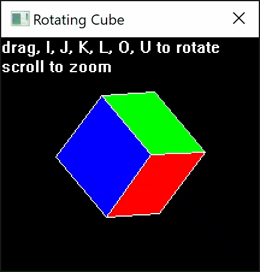

# win32-GDI_Interact

Minimal example of user interaction with a GDI drawing of a rotating cube.

To run, simply run `zig run main.zig`.

NOTE: Use Zig 0.12.x releases, as this example uses destructuring syntax.

[(download compiled exe)](https://github.com/Zig-Samples/win32-GDI_Interact/files/14625990/cube.zip)